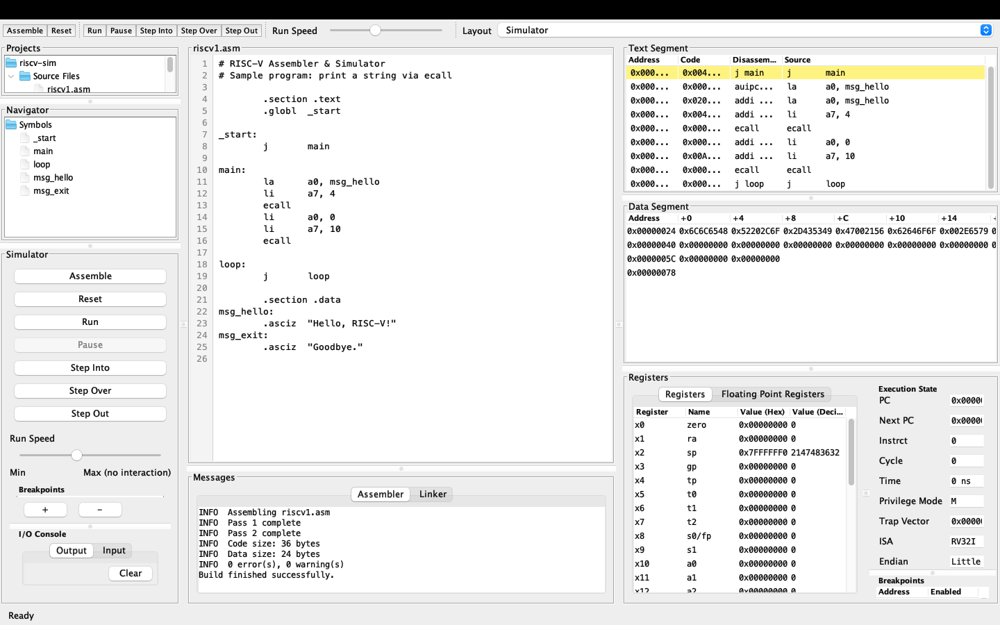
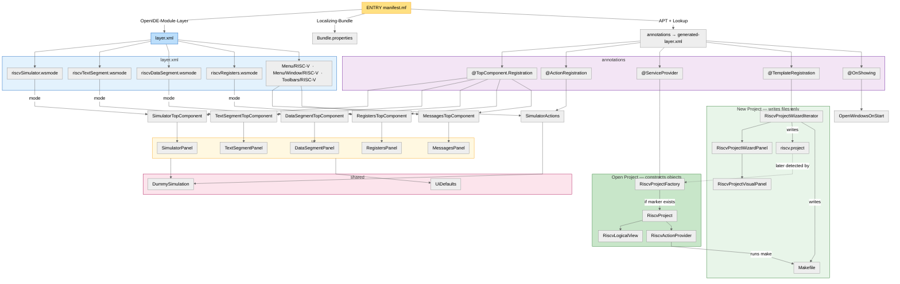

# RISC-V Studio

NetBeans module that turns the IDE into a RISC-V assembler and simulator.



```sh
mvn nbm:run
```

## Source Structure

Entry: `src/main/nbm/manifest.mf` → `layer.xml` + annotations.


